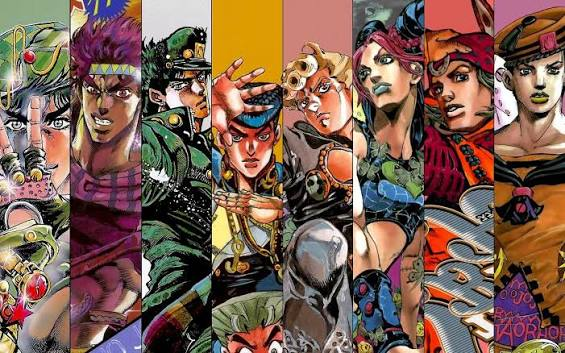

cat > markdown.md << 'EOF'
# JoJo's Bizarre Adventure

## Introducción

**JoJo's Bizarre Adventure** es un manga de *Hirohiko Araki* cuyos personajes usan poderes llamados Stands, como `Star Platinum` pero originalmente se usaba el `Hamon`.

```bash
echo "ORA ORA ORA"
echo "MUDA MUDA MUDA"
```

## Partes

- Phantom Blood
- Battle Tendency
- Stardust Crusaders

## Protagonistas

1. Jonathan Joestar
2. Joseph Joestar
3. Jotaro Kujo


| Parte                  | Protagonista | Stand         |
|------------------------|--------------|---------------|
| Stardust Crusaders     | Jotaro       | Star Platinum |
| Diamond is Unbreakable | Josuke       | Crazy Diamond |

[Enlace externo](https://es.wikipedia.org/wiki/JoJo%27s_Bizarre_Adventure)

[Enlace a detalles](docs/detalles.md)




